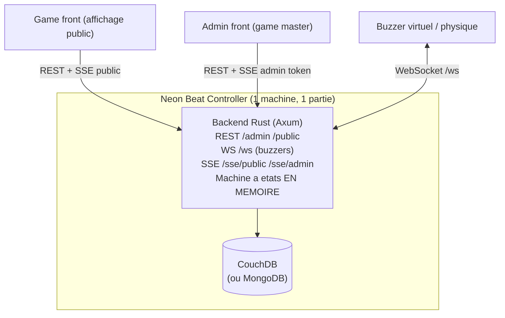
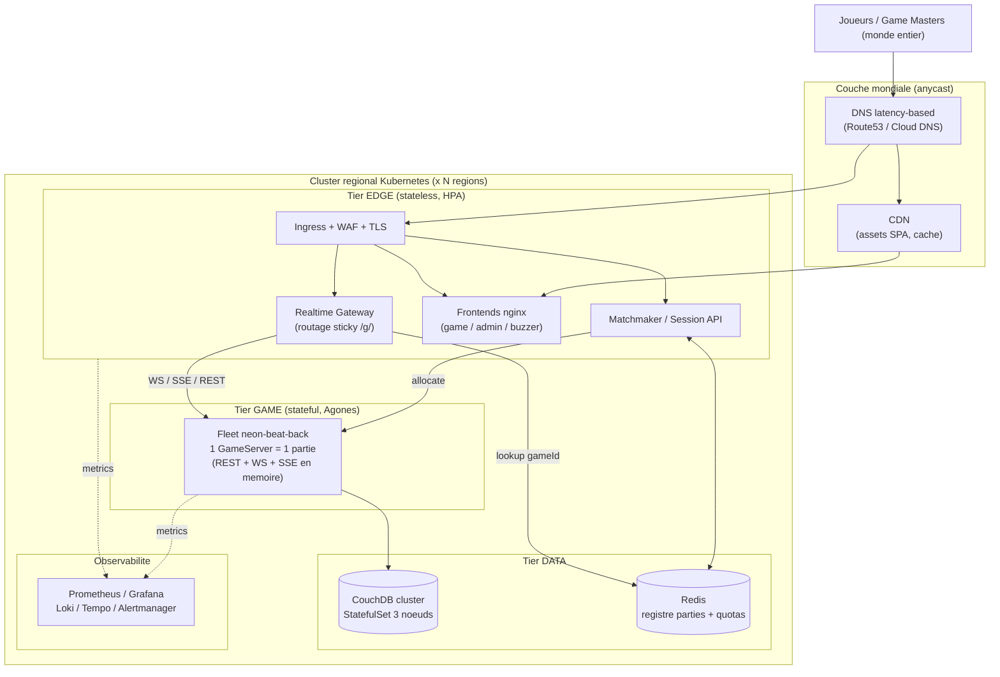
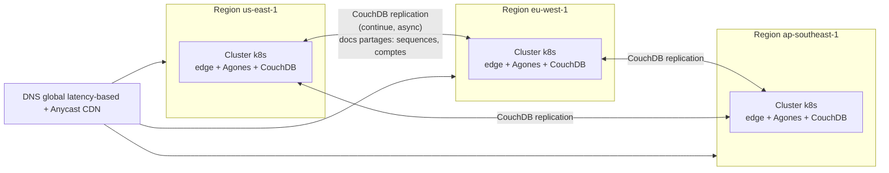
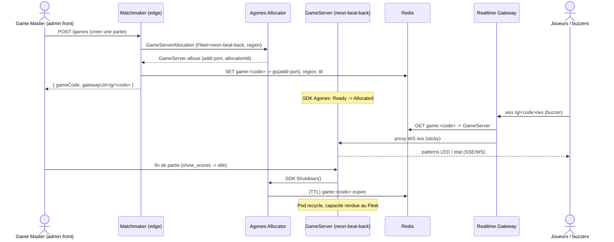
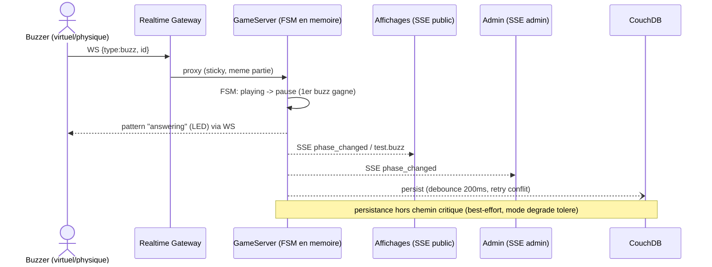
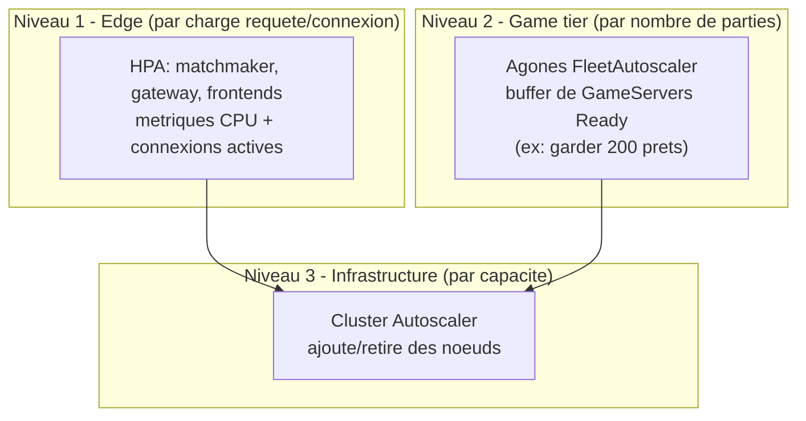
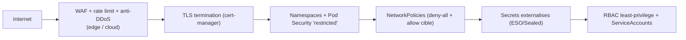
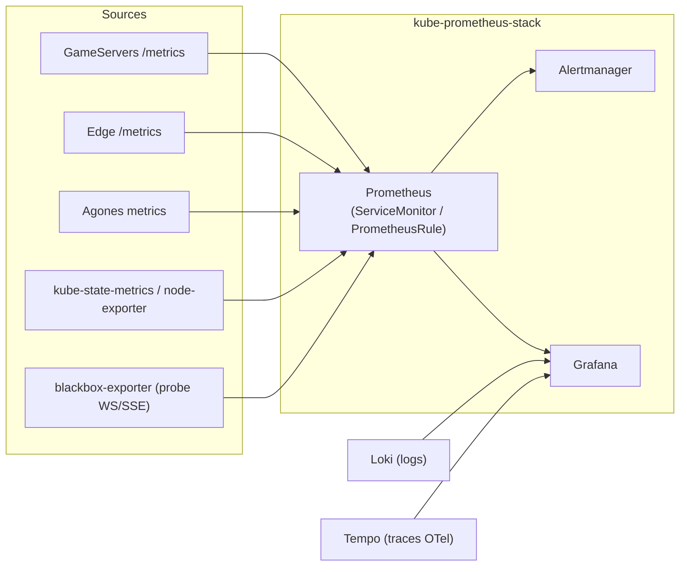

# Résumé exécutif

Neon Beat est un blindtest temps réel composé d'un backend Rust, d'une base
NoSQL (CouchDB), de trois frontends (jeu, admin, buzzer virtuel) et de buzzers
physiques. L'application est aujourd'hui déployée *On-Premise*, sur un unique
« contrôleur » matériel hébergeant une **partie à la fois**.

L'objectif est de diffuser le service **à l'échelle mondiale** : **10 000
joueurs simultanés** en régime nominal, avec un **pic de 100 000 joueurs par
semaine**, les joueurs du monde entier devant pouvoir rejoindre une partie
partagée **sans dégradation de l'expérience temps réel**.

La contrainte structurante, déduite de l'analyse du code, est que le backend
est **fortement stateful et mono-partie** : la machine à états du jeu, les hubs
SSE et la table des connexions WebSocket des buzzers vivent **en mémoire d'un
seul processus**, et le flux SSE admin n'autorise qu'**une seule connexion**.
On ne peut donc pas se contenter de répliquer le backend derrière un load
balancer round-robin.

La stratégie retenue traite donc Neon Beat comme une plateforme de **serveurs
de jeu dédiés** (pattern *dedicated game server*), orchestrés par **Agones** sur
Kubernetes, derrière un **edge stateless** mondial (frontends servis par CDN,
passerelle temps réel, service de *matchmaking*) et adossés à une couche de
données **CouchDB multi-région**. Le tout est rendu observable (Prometheus /
Grafana / Loki / Tempo), sécurisé (TLS de bout en bout, NetworkPolicies, RBAC,
WAF, secrets externalisés) et résilient (multi-AZ, multi-région, PDB,
autoscaling à plusieurs niveaux).

---

# 1. Analyse de la problématique

## 1.1 Architecture actuelle (On-Premise)



Caractéristiques tirées du code (`neon-beat-back`) :

- **Backend Rust mono-binaire** (port 8080) exposant simultanément REST,
  WebSocket (`/ws`) et SSE (`/sse/public`, `/sse/admin`).
- **État en mémoire** : la `state machine` (FSM), la `GameSession`, les hubs
  SSE et la *map* des connexions buzzers sont conservés dans le processus. La
  persistance CouchDB est faite avec un **debounce de 200 ms**, du **locking
  par équipe** et un **retry optimiste** sur conflit 409.
- **Mono-partie** : une seule FSM est instanciée ; l'admin SSE est **limité à
  une connexion** ; les couleurs d'équipe par défaut plafonnent à 20 — la
  granularité naturelle est donc « une partie = un game master + ~quelques
  dizaines de joueurs ».
- **Mode dégradé** : le backend continue de fonctionner si la base est
  momentanément indisponible et se reconnecte automatiquement.
- **Frontends** : SPA React/Vite statiques, configurées par
  `VITE_API_BASE_URL` (une URL backend par build).

## 1.2 Cible et modèle de charge

Le scénario impose : **10 000 joueurs simultanés**, **100 000 joueurs / semaine
en pic**, diffusion **mondiale**, parties partagées **sans compromis de
performance**.

### Hypothèses de charge (explicites)

La formulation « se connecter à la même partie » est interprétée au sens
**produit** : des joueurs du monde entier rejoignent des **parties live
partagées** (et non une partie physique unique dans une salle). Comme le moteur
de jeu est conçu pour **une partie ≈ un game master + plusieurs dizaines de
joueurs**, 10 000 joueurs simultanés ne signifient pas 10 000 joueurs dans une
seule FSM (ce que le modèle ne supporte pas), mais **un grand nombre de parties
indépendantes exécutées en parallèle**.

| Paramètre                      | Hypothèse                              | Justification                          |
| ------------------------------ | -------------------------------------- | -------------------------------------- |
| Joueurs / partie (moyenne)     | 15                                     | ≈ équipes (≤20 couleurs) + spectateurs |
| Parties simultanées (nominal)  | ~660                                   | 10 000 / 15                            |
| Parties simultanées (pic)      | ~2 000–3 000                           | facteur de concentration du pic hebdo  |
| Connexions temps réel / joueur | 1 WS (buzzer) **ou** 1 SSE (affichage) | un joueur = un onglet                  |
| Connexions admin / partie      | 1 SSE admin (single) + REST            | enforced par le backend                |
| Débit d'événements             | rafales courtes (buzz, reveal)         | trafic *bursty*, pas *streaming* lourd |

Conséquence de dimensionnement : le facteur dominant n'est pas le CPU mais le
**nombre de connexions longue durée** et le **nombre de parties à placer et à
router**. C'est un problème d'**allocation de serveurs de jeu**, pas de tier web
stateless classique.

## 1.3 La tension centrale à résoudre

> **On ne peut pas scaler horizontalement un backend stateful mono-partie en le
> mettant simplement derrière un Service round-robin** : les connexions
> WS/SSE et la FSM d'une partie donnée doivent toutes atteindre **le même
> processus**. Le cœur de l'architecture consiste donc à (1) router de façon
> *sticky* tous les participants d'une partie vers l'instance qui détient son
> état, et (2) allouer/recycler dynamiquement ces instances en fonction de la
> charge.

---

# 2. Points critiques

| #   | Point critique                                                                                                                   | Impact                         | Traitement (section) |
| --- | -------------------------------------------------------------------------------------------------------------------------------- | ------------------------------ | -------------------- |
| C1  | **Statefulness mono-partie** : état en mémoire, routage *sticky* obligatoire                                                     | Bloquant pour la scalabilité   | §3, §4 (Agones)      |
| C2  | **Connexions temps réel longues** (WS buzzers, SSE) : pas de répartition par requête, *draining* nécessaire                      | Coupures de partie si mal géré | §5, §6               |
| C3  | **Latence géographique & équité du buzzer** : un buzzer est une *course* ; la FSM est mono-instance, donc mono-région par partie | Iniquité inter-continents      | §2.1, §5             |
| C4  | **CouchDB** : doit être clusterisée, géo-répliquée, et ne doit pas devenir le goulot (le backend amortit déjà via debounce)      | Perte d'état, contention       | §4.3, §6             |
| C5  | **Pic 15× (10k → 100k/sem)** : capacité élastique sans surcoût permanent                                                         | Coût / rupture de capacité     | §6 (autoscaling)     |
| C6  | **Sécurité** : token admin, anti-DDoS sur endpoints publics non authentifiés (SSE public, WS), isolation multi-tenant            | Triche, abus, fuite            | §7                   |
| C7  | **Observabilité du temps réel** : métriques de connexions, latence de buzz, santé des parties                                    | Cécité opérationnelle          | §8                   |
| C8  | **Coût des connexions oisives** : milliers de WS/SSE inactifs consomment mémoire/FD                                              | Gaspillage                     | §6                   |

## 2.1 Le point dur : équité du buzz à l'échelle mondiale

Un blindtest est une **course au buzzer** : l'arbitrage « qui a buzzé en
premier » se fait dans **une seule FSM**, sur **un seul nœud**, dans **une seule
région**. Deux conséquences honnêtes :

1. **On ne peut pas répartir une même partie sur plusieurs régions** sans
   introduire un consensus distribué qui détruirait la latence de buzz. Une
   partie a donc **une région d'ancrage**.
2. Pour deux joueurs aux RTT très différents (ex. Paris 20 ms vs Sydney 280 ms
   vers une partie ancrée en `eu-west`), l'équité est physiquement compromise.

**Mitigations retenues :**

- **Placement régional de la partie** : le *matchmaker* ancre chaque nouvelle
  partie dans la **région la plus proche de la majorité des participants** (ou
  du game master). La plupart des parties sont géographiquement cohérentes.
- **Edge mondial pour les assets** : frontends servis par CDN/anycast → latence
  de chargement faible partout, indépendamment de la région de la partie.
- **(Évolution produit, hors périmètre infra)** arbitrage du buzz par
  **horodatage côté client réconcilié serveur** (compensation du RTT connu),
  pour atténuer l'asymétrie sur les parties intercontinentales. Noté comme
  amélioration applicative, non implémentée dans ce livrable.

---

# 3. Composants Kubernetes retenus et justifications

| Besoin                                                            | Composant k8s / écosystème                                                              | Justification                                                                                                                                       |
| ----------------------------------------------------------------- | --------------------------------------------------------------------------------------- | --------------------------------------------------------------------------------------------------------------------------------------------------- |
| Serveurs de jeu dédiés, allocation/recyclage, *sticky* par partie | **Agones** (`Fleet`, `GameServer`, `FleetAutoscaler`, `GameServerAllocation`)           | Standard CNCF du *dedicated game server* ; résout C1/C2 nativement (1 partie = 1 `GameServer`, allocation à la demande, *connection-based scaling*) |
| Frontends statiques                                               | `Deployment` nginx + `Service` + **CDN** en amont                                       | SPA immuables, cache agressif, coût quasi nul                                                                                                       |
| Matchmaking / création de partie                                  | `Deployment` stateless + `HPA`                                                          | Sans état, scale linéaire ; appelle l'Allocator Agones                                                                                              |
| Passerelle temps réel (TLS, routage *sticky*, WAF)                | `Deployment` Envoy/NGINX + `HPA`                                                        | Termine TLS, route `/g/<id>/*` vers le bon `GameServer`                                                                                             |
| Entrée HTTP/S                                                     | `Ingress` (NGINX Ingress Controller) + cloud LB                                         | TLS, annotations WS/SSE, hôtes                                                                                                                      |
| Persistance                                                       | **CouchDB** en `StatefulSet` (cluster) + `PVC` + `PDB`                                  | Multi-master géo-réplicable, cohérent avec le mode dégradé/retry du backend                                                                         |
| Registre de parties / rate-limit                                  | **Redis** (`StatefulSet`)                                                               | Mapping `gameId → GameServer`, quotas                                                                                                               |
| Configuration / secrets                                           | `ConfigMap`, `Secret`, **External Secrets / Sealed Secrets**                            | Pas de secret en clair dans Git                                                                                                                     |
| Élasticité                                                        | `HPA` (edge), **`FleetAutoscaler`** (game tier), **Cluster Autoscaler** (nœuds)         | Élasticité à 3 niveaux pour le pic 15× (C5)                                                                                                         |
| Disponibilité                                                     | `PodDisruptionBudget`, anti-affinité, multi-AZ                                          | Tolérance aux pannes nœud/zone                                                                                                                      |
| Réseau                                                            | `NetworkPolicy`                                                                         | Micro-segmentation est↔ouest (C6)                                                                                                                   |
| TLS automatisé                                                    | **cert-manager** (`ClusterIssuer`, `Certificate`)                                       | Let's Encrypt, rotation                                                                                                                             |
| Observabilité                                                     | **kube-prometheus-stack**, `ServiceMonitor`, `PrometheusRule`, **Loki**, **Tempo/OTel** | Métriques, logs, traces (C7)                                                                                                                        |
| Politique de sécurité pods                                        | **Pod Security Standards** (`restricted`), `LimitRange`, `ResourceQuota`                | Durcissement par namespace                                                                                                                          |

> **Prérequis applicatif (hors périmètre infra, explicitement noté)** : le
> backend Rust doit embarquer le **SDK Agones** (appels `Ready()` /
> `Health()` / `Shutdown()` / `Allocate()` via le sidecar `sdk-server`). C'est
> un changement applicatif borné, signalé ici et **non traité** dans ce
> livrable d'infrastructure. À défaut, l'architecture de repli (routage
> *sticky* via Redis + StatefulSet) est décrite en §11.

---

# 4. Architecture cible

## 4.1 Vue d'ensemble en tiers



**Principe** : l'**edge** est stateless et scale par requête/connexion ; le
**game tier** est stateful, une partie par `GameServer`, scalé par *nombre de
parties* ; la **donnée** est clusterisée et géo-répliquée. Tout le routage
temps réel d'une partie est **épinglé** (sticky) vers son `GameServer`.

## 4.2 Topologie multi-région



- **Chaque région est autonome** : un cluster complet (edge + Agones +
  CouchDB). Une partie est **entièrement servie dans une région**.
- **Réplication CouchDB inter-région** (continue, asynchrone) pour les données
  *partagées et peu conflictuelles* : séquences de questions, catalogues,
  comptes. L'**état live d'une partie** reste **local à sa région** (pas de
  réplication synchrone cross-region sur le chemin chaud → préserve la latence
  C3). La réplication multi-master de CouchDB est ici un atout : elle colle au
  mode dégradé/retry déjà présent dans le backend.
- **DNS latency-based** dirige le joueur vers la région la plus proche pour la
  création de partie ; le *matchmaker* peut rediriger vers la région d'ancrage
  d'une partie existante (join par code).

## 4.3 Cycle de vie d'une partie (Agones)



## 4.4 Flux d'un buzz (chemin chaud temps réel)



Le chemin critique du buzz est **entièrement en mémoire** dans le `GameServer` :
la latence perçue = RTT joueur↔gateway + gateway↔GameServer (intra-région,
< 5 ms) + traitement FSM (négligeable). La persistance est **asynchrone** et
hors du chemin critique.

---

# 5. Gestion du temps réel

| Mécanisme                       | Mise en œuvre                                                                                                                                                                                               |
| ------------------------------- | ----------------------------------------------------------------------------------------------------------------------------------------------------------------------------------------------------------- |
| **Sticky par partie**           | Allocation Agones + lookup `gameId → GameServer` (Redis) à la passerelle. Toutes les connexions WS/SSE/REST d'une partie atteignent le même processus.                                                      |
| **WebSocket (buzzers)**         | Ingress/gateway avec *upgrade* HTTP, timeouts longs (`proxy-read-timeout` 3600s), heartbeats applicatifs (le backend ré-identifie et restaure les patterns à la reconnexion).                               |
| **SSE (frontends)**             | `proxy-buffering: off`, pas de compression bufferisée, keep-alive 15s (déjà émis par le backend), timeouts longs.                                                                                           |
| **Draining des connexions**     | `terminationGracePeriodSeconds` élevé + le backend **flush déjà les écritures en attente sur SIGTERM** ; Agones marque le `GameServer` `Shutdown` seulement en fin de partie (pas de coupure en plein jeu). |
| **Pas de réallocation à chaud** | Une partie ne migre pas de pod ; un `GameServer` n'est recyclé qu'**après** la fin de partie (état `show_scores → idle`).                                                                                   |
| **Latence**                     | Partie ancrée en région proche ; passerelle intra-cluster ; chemin de buzz en mémoire (§4.4).                                                                                                               |

Le « single admin SSE » du backend est respecté nativement : un `GameServer` =
une partie = un game master.

---

# 6. Scalabilité et résilience

## 6.1 Élasticité à trois niveaux (pour le pic 15×)



- **Edge (HPA)** : `matchmaker`, `gateway`, `frontends` scalent sur CPU **et
  métrique custom « connexions actives »** (via Prometheus Adapter), car le
  facteur dominant est la connexion, pas le CPU.
- **Game tier (FleetAutoscaler)** : maintient un **buffer de `GameServer`
  `Ready`** (capacité chaude) pour absorber les rafales de création de parties
  sans cold start. Buffer dimensionné pour le pic (ex. 200–500 serveurs prêts).
- **Nœuds (Cluster Autoscaler)** : ajoute des nœuds quand HPA/Fleet le
  réclament ; les retire en heures creuses → **coût aligné sur l'usage** (clé
  pour un pic hebdomadaire ponctuel).
- **Provisionnement anticipé** : si le pic hebdo est prévisible (ex. soirée
  événement), un `CronJob`/scheduled scaling pré-chauffe le buffer Agones et les
  nœuds avant l'heure.

## 6.2 Résilience

| Mécanisme                  | Détail                                                                                                                                                         |
| -------------------------- | -------------------------------------------------------------------------------------------------------------------------------------------------------------- |
| **Multi-AZ**               | Nœuds répartis sur ≥3 zones ; `topologySpreadConstraints` / anti-affinité.                                                                                     |
| **Multi-région**           | Perte d'une région → DNS bascule les *nouvelles* parties ailleurs ; les parties en cours dans la région perdue sont interrompues (état persisté → rejouables). |
| **PodDisruptionBudget**    | Protège edge, CouchDB, Redis pendant *drain*/upgrade.                                                                                                          |
| **Probes**                 | `liveness`/`readiness`/`startup` sur `/healthcheck` (déjà exposé) ; Agones *health* via SDK.                                                                   |
| **CouchDB**                | Cluster 3 nœuds (quorum), PVC répliqués, PDB ; le backend tolère déjà l'indisponibilité (mode dégradé + reconnexion + retry 409).                              |
| **Graceful shutdown**      | Flush des écritures en attente sur SIGTERM (comportement backend existant) + `preStop` + grace period.                                                         |
| **Reprise sur incident**   | L'état de partie est sauvegardé régulièrement → une partie peut être rechargée après crash (fonctionnalité backend existante).                                 |
| **Idempotence allocation** | Le matchmaker écrit le mapping en Redis avec TTL ; reconciliation possible via l'API Agones.                                                                   |

## 6.3 Dimensionnement indicatif

| Tier                        | Unité                       | Nominal    | Pic                   |
| --------------------------- | --------------------------- | ---------- | --------------------- |
| GameServers (parties)       | pod ~0.25 vCPU / 256–512 Mi | ~660       | ~2 000–3 000 + buffer |
| Gateway (connexions WS/SSE) | ~10–20k conn/pod            | 1–2 pods   | 8–12 pods             |
| Matchmaker                  | req/s                       | 2 pods     | 6–10 pods             |
| CouchDB                     | nœuds                       | 3 / région | 3–5 / région          |
| Redis                       | nœud + replica              | 1+1        | 1+1                   |

> Les connexions longues (et non le CPU) dimensionnent l'edge ; les FD/mémoire
> par pod gateway sont le facteur limitant → tuning `ulimit` / `net.core.*`.

---

# 7. Sécurité



| Domaine                                | Mesure                                                                                                                                                                          |
| -------------------------------------- | ------------------------------------------------------------------------------------------------------------------------------------------------------------------------------- |
| **Chiffrement**                        | TLS partout (front + WS `wss` + SSE) via cert-manager/Let's Encrypt ; mTLS est↔ouest possible via service mesh (option).                                                        |
| **Endpoints publics non authentifiés** | `/sse/public` et `/ws` sont ouverts par design → **rate limiting** par IP au WAF, quotas Redis, *connection caps* par partie, protection anti-DDoS L3/L4 du cloud.              |
| **Admin**                              | Token admin (handshake SSE) déjà en place ; au-delà : authentification du game master à l'edge (OIDC) avant `POST /games`, et isolement du chemin `/admin` derrière auth forte. |
| **Isolation multi-tenant**             | Une partie = un pod isolé (pas de fuite d'état inter-parties) ; `NetworkPolicy` deny-all par défaut puis autorisations ciblées (gateway→GS, GS→CouchDB, matchmaker→Allocator).  |
| **Secrets**                            | Aucun secret en clair dans Git : **External Secrets Operator** (depuis un coffre cloud) ou **Sealed Secrets**. Rotation des credentials CouchDB/Redis.                          |
| **RBAC**                               | `ServiceAccount` dédiés, droits minimaux ; le matchmaker n'a que le droit `GameServerAllocation` ; aucun pod applicatif n'a accès cluster-admin.                                |
| **Durcissement pods**                  | Pod Security Standards `restricted` : `runAsNonRoot`, `readOnlyRootFilesystem`, drop `ALL` capabilities, `seccompProfile: RuntimeDefault`.                                      |
| **Chaîne d'appro**                     | Images scannées (Trivy), signées (cosign), `imagePullPolicy` pinné par digest, registre privé.                                                                                  |
| **Quotas**                             | `ResourceQuota` / `LimitRange` par namespace pour éviter qu'un tenant/tier n'épuise le cluster.                                                                                 |

---

# 8. Monitoring & observabilité



**Trois piliers :**

- **Métriques (Prometheus)** : exposées via `ServiceMonitor` ; règles d'alerte
  via `PrometheusRule`. KPIs métier/temps réel :
  - parties actives, allocations/s, `GameServers` `Ready` vs `Allocated`
    (capacité buffer), échecs d'allocation ;
  - connexions WS/SSE actives par pod gateway, taux de déconnexion ;
  - **latence de buzz** (histogramme côté GameServer), p99 ;
  - santé CouchDB (lag de réplication, conflits 409, mode dégradé backend) ;
  - saturation (CPU, mémoire, FD, file descriptors des gateways).
- **Logs (Loki)** : agrégation structurée (le backend log en `tracing`),
  corrélés par `gameId`/`allocationId`.
- **Traces (Tempo/OpenTelemetry)** : trace création de partie (matchmaker →
  allocator → GameServer) et requêtes admin.

**Alerting (exemples)** : buffer Agones `Ready` < seuil (risque de cold start
au prochain pic), échecs d'allocation > 0, p99 latence buzz > X ms, lag
réplication CouchDB, mode dégradé backend actif > N s, saturation FD gateway.
**SLO** : disponibilité de création de partie, latence de buzz p99, taux de
coupure de connexion temps réel.

---

# 9. Livrable IaC — structure et découpage des composants

Le ZIP (`k8s/`) est organisé par **tier**, applicable dans l'ordre, et
compatible **Kustomize** :

```
k8s/
├── 00-namespaces/        Namespaces + Pod Security labels
├── 01-edge/              Frontends, matchmaker, gateway, ingress, HPA
├── 02-game-tier/         Agones Fleet + FleetAutoscaler + allocation
├── 03-data/              CouchDB (StatefulSet cluster), Redis, secrets
├── 04-security/          NetworkPolicies, RBAC, cert-manager, quotas
├── 05-observability/     ServiceMonitors, PrometheusRules, Grafana
└── kustomization.yaml    Agrégation
```

Justification du découpage : isolation des préoccupations (chaque tier a son
cycle de vie et ses droits), application incrémentale, revue facilitée,
réutilisation par région (overlay Kustomize par région). Voir `k8s/README.md`
pour l'ordre d'application et les prérequis (Agones, cert-manager,
kube-prometheus-stack, metrics-adapter).

---

# 10. Points de vigilance

- **Prérequis applicatif Agones** : intégration du SDK dans le backend Rust
  (sinon, repli §11). C'est le principal couplage infra↔code.
- **Équité intercontinentale du buzz** (C3) : non résoluble sans changement
  produit ; documentée et atténuée par placement régional.
- **Coût des connexions oisives** : surveiller FD/mémoire gateway ; envisager
  une expiration des parties inactives (TTL Redis + Shutdown).
- **Réplication CouchDB** : cross-region asynchrone → conflits possibles sur
  données partagées ; réservée aux entités peu conflictuelles (l'état live reste
  régional).
- **Pré-chauffage du pic** : un pic mal anticipé peut épuiser le buffer Agones ;
  scheduled scaling recommandé si le pic est calendaire.
- **Limites de connexions par LB cloud** : vérifier les quotas (connexions
  concurrentes, durée idle) du load balancer managé.

---

# 11. Architecture de repli (sans modification du backend)

Si l'intégration du SDK Agones n'est pas possible à court terme :

- **StatefulSet** de backends par région (DNS stable par pod via *headless
  service*), HPA sur métrique « parties actives ».
- **Matchmaker** maintient lui-même le pool : sélectionne un pod libre, écrit
  `gameId → podDNS` en Redis (avec occupation), recycle à la fin de partie.
- **Gateway** route `/g/<id>/*` vers le pod via le mapping Redis (sticky).

Trade-off : on réimplémente manuellement allocation, *health-checking*,
recyclage et *connection-based scaling* qu'Agones fournit clés en main → plus de
code plateforme à maintenir, moins robuste. C'est pourquoi **Agones est
recommandé** comme cible.

---

# Annexe A — Prérequis cluster

- Kubernetes ≥ 1.28 managé (GKE/EKS/AKS), multi-AZ, Cluster Autoscaler activé.
- **Agones** installé (`agones-system`).
- **cert-manager** + `ClusterIssuer` Let's Encrypt.
- **NGINX Ingress Controller** (ou équivalent) avec support WS/SSE.
- **kube-prometheus-stack** (Prometheus Operator) + **Prometheus Adapter**
  (métriques custom pour HPA) + **Loki** + **Tempo**.
- **External Secrets Operator** (ou Sealed Secrets).

# Annexe B — Correspondance avec la grille d'évaluation

| Critère                           | Section(s)                   |
| --------------------------------- | ---------------------------- |
| Analyse de la problématique       | §1                           |
| Points critiques                  | §2                           |
| Bons composants k8s               | §3, §9, ZIP                  |
| Schémas d'architecture            | §1.1, §4.1–4.4, §6.1, §7, §8 |
| Scalabilité & résilience          | §6                           |
| Sécurité                          | §7                           |
| Monitoring                        | §8                           |
| Gestion du temps réel             | §4.4, §5                     |
| Cohérence / IaC / découpage (ZIP) | §9 + `k8s/**`                |
