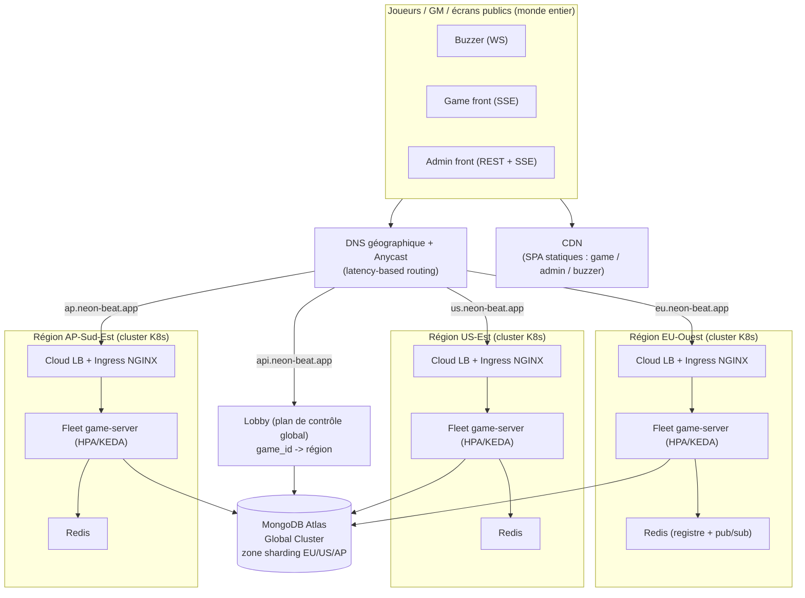
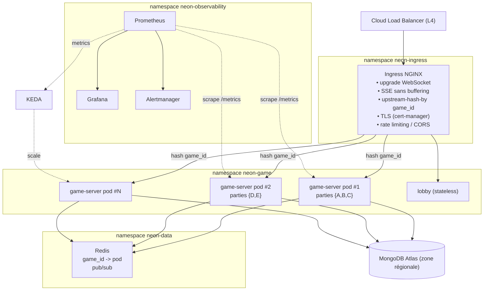
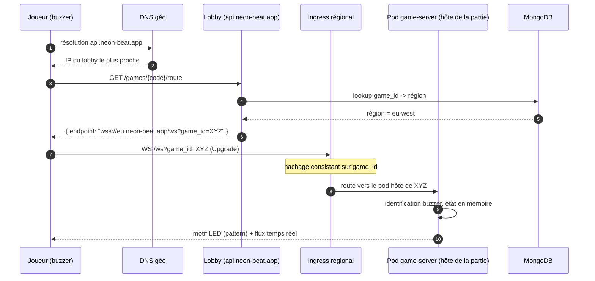
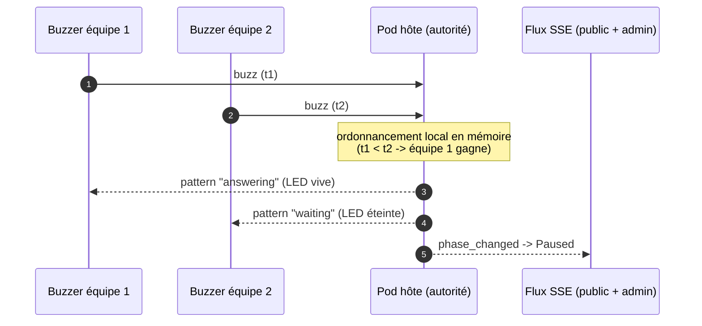
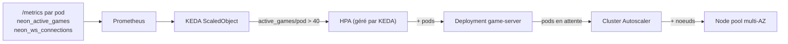
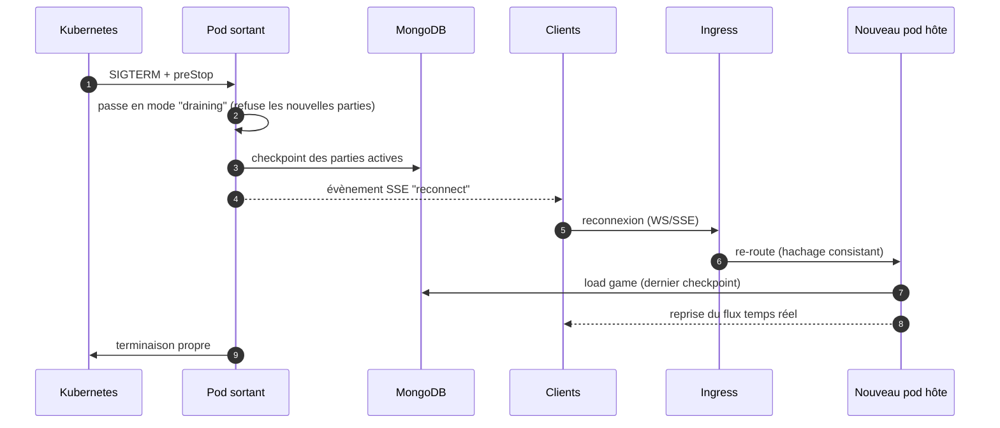
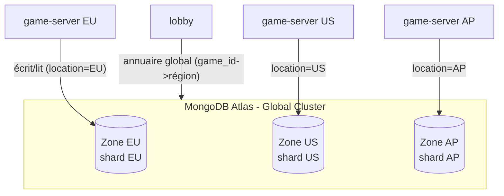
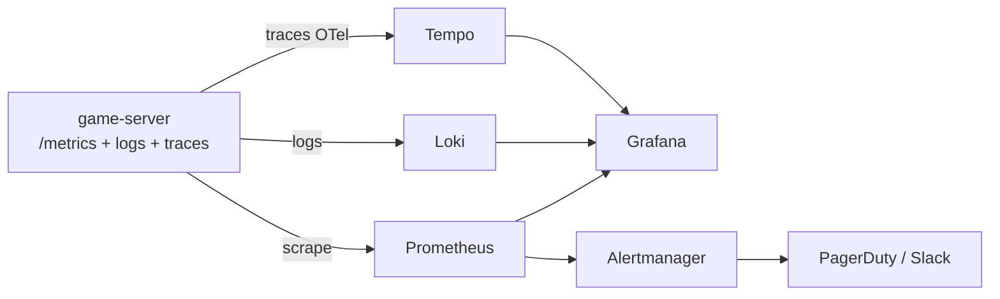

# Neon Beat - Architecture cloud de déploiement mondial

Rapport d'architecture pour le passage de Neon Beat d'un déploiement *On Premise* mono-partie à une plateforme SaaS mondiale, temps réel, supportant 10 000 joueurs simultanés (pic) et jusqu'à 100 000 joueurs par semaine.

## Sommaire

1. [Analyse du problème](#1-analyse-du-problème)
2. [Rappel de l'application existante](#2-rappel-de-lapplication-existante)
3. [Identification des points critiques](#3-identification-des-points-critiques)
4. [Principes directeurs et choix structurants](#4-principes-directeurs-et-choix-structurants)
5. [Architecture cible](#5-architecture-cible)
6. [Choix des composants Kubernetes](#6-choix-des-composants-kubernetes)
7. [Gestion du temps réel](#7-gestion-du-temps-réel)
8. [Scalabilité et dimensionnement](#8-scalabilité-et-dimensionnement)
9. [Résilience et continuité de service](#9-résilience-et-continuité-de-service)
10. [Base de données multi-région](#10-base-de-données-multi-région)
11. [Sécurité](#11-sécurité)
12. [Supervision](#12-supervision)
13. [Évolutions nécessaires côté applicatif](#13-évolutions-nécessaires-côté-applicatif)
14. [Synthèse des choix](#14-synthèse-des-choix)

---

## 1. Analyse du problème

### 1.1 Le besoin

Neon Beat est un blindtest temps réel : un maitre du jeu (Game Master ou GM) anime une partie, des équipes répondent via des buzzers, et des écrans public affichent l'état du jeu. 
Il semblerait que, historiquement, tout se déroulait dans une même pièce, sur un unique contrôleur matériel hébergeant l'ensemble des services.

L'objectif est maintenant d'ouvrir le jeu **au monde entier** :

| Exigence                    | Valeur cible                               |
| --------------------------- | ------------------------------------------ |
| Joueurs simultanés (pic)    | 10 000                                     |
| Joueurs cumulés par semaine | 100 000                                    |
| Répartition géographique    | Mondiale, toutes zones                     |
| Latence ressentie           | Faible et homogène quelle que soit la zone |
| Disponibilité               | Service continu, tolérant aux pannes       |

### 1.2 La tension centrale

Le défi n'est pas le volume de calcul (1 *blindtest consomme peu de CPU en soit donc c'est OK) mais plutôt la combinaison de trois facteurs :
1. **Le temps réel.** Un buzz doit être arbitré (qui a appuyé en premier) de façon instantanée et incontestable. La latence réseau internationale (jusqu'à 350 ms entre continents) est l'ennemi princiaple.
2. **L'état en mémoire.** Le backend maintient l'état d'une partie *en RAM* (machine à états finis, *hubs* de diffusion, registre des buzzers). C'est un service **avec état**, ce qui s'oppose au modèle "pods interchangeables" habituel.
3. **Les connexions longues.** Chaque client garde une connexion ouverte en permanence (WebSocket pour les buzzers, SSE pour les interfaces). On ne raisonne donc pas en "requêtes par seconde" mais en "connexions concurrentes maintenues", ce qui change les règles d'équilibrage de charge et d'autoscaling quon a l'habitude de voir.

### 1.3 Reformulation

Concevoir une plateforme qui héberge **un grand nombre de parties indépendantes** (multi-tenant), réparties **par région** pour minimiser la latence, où **chaque partie vit sur un pod unique** mais où **la perte de ce pod n'entraîne pas la perte de la partie**.

---

## 2. Rappel de l'application existante

Quatre dépôts composent la plateforme actuelle :

| Composant                  | Techno            | Rôle                                      | Nature                  |
| -------------------------- | ----------------- | ----------------------------------------- | ----------------------- |
| `neon-beat-back`           | Rust (Axum/Tokio) | API REST + WebSocket + SSE, moteur de jeu | **Avec état (mémoire)** |
| `neon-beat-game-front`     | React/Vite (SPA)  | Affichage public de la partie             | Statique                |
| `neon-beat-admin-front`    | React/Vite (SPA)  | Console du Game Master                    | Statique                |
| `neon-beat-virtual-buzzer` | React/Vite (SPA)  | Buzzer logiciel (remplace le matériel)    | Statique                |

Le backend expose trois canaux (cf. `PROTOCOLS.md`) :

- **REST** : contrôle de la partie (création, scores, révélation...).
- **WebSocket `/ws`** : bidirectionnel, pour les buzzers (identification, buzz, motifs LED).
- **SSE `/sse/public` et `/sse/admin`** : flux d'événements unidirectionnels vers les interfaces (une seule connexion admin autorisée par partie).

Point déterminant relevé dans le code (`neon-beat-back/src/state/mod.rs`) :
```rust
pub struct AppState {
    // Une seule partie par processus.
    current_game: RwLock<Option<GameSession>>,
    // ...
}
```

-> **Un processus backend = une partie.** C'est le constat qui dicte toute l'architecture cloud.

Élément favorable, en revanche : le backend persiste l'état de la partie en continu en base (écritures *debouncées* à 200 ms, *retry* optimiste, *flush* à l'arrêt).
Une partie peut donc être **rechargée** depuis la base après un redémarrage. Cette propriété est la clé qui rend le modèle "stateful" tolérant aux pannes dans le cloud.

---

## 3. Identification des points critiques

| #   | Point critique                                      | Conséquence                                                                                            | Réponse architecturale                                                                              |
| --- | --------------------------------------------------- | ------------------------------------------------------------------------------------------------------ | --------------------------------------------------------------------------------------------------- |
| C1  | **État en mémoire, mono-partie par processus**      | Impossible de répartir une partie sur plusieurs pods ; un client doit toujours retomber sur le bon pod | Affinité de partie (hachage consistant sur `game_id`) + évolution multi-parties du backend          |
| C2  | **Connexions longues (WS/SSE)**                     | Le rééquilibrage ne se fait pas tout seul ; un *scale-down* ou un déploiement coupe les connexions     | `maxUnavailable: 0`, *drain* contrôlé, reconnexion client, *timeouts* longs sur l'Ingress           |
| C3  | **Latence internationale**                          | Expérience dégradée pour les joueurs éloignés du serveur                                               | Déploiement multi-région + DNS géographique + ancrage régional des parties                          |
| C4  | **Arbitrage des buzz**                              | Le "premier buzz" doit être incontestable                                                              | Autorité unique : le pod hôte de la partie ordonne les buzz (pas de consensus distribué nécessaire) |
| C5  | **Pic de charge soudain**                           | 10 000 joueurs peuvent arriver en quelques minutes                                                     | Autoscaling sur métriques métier (KEDA) + socle chaud + Cluster Autoscaler                          |
| C6  | **Dépendance base de données**                      | Mode dégradé si la DB est injoignable                                                                  | Persistance régionale, *probes* de *readiness*, mode dégradé déjà géré par le backend               |
| C7  | **CORS permissif, pas d'authentification publique** | Surface d'attaque, abus possibles (spam de buzz)                                                       | Verrouillage CORS au bord, *rate limiting*, WAF, NetworkPolicies                                    |
| C8  | **Perte d'un pod = perte d'une partie ?**           | Interruption de jeu                                                                                    | Rechargement depuis le dernier *checkpoint* en base (perte <= 200 ms)                               |

---

## 4. Principes directeurs et choix structurants

### 4.1 Modèle de scaling : "sharding par partie" plutôt que réplication

Le scaling horizontal classique (N pods identiques derrière un load balancer
*round-robin*) **ne fonctionne pas** ici : l'état d'une partie n'existe que sur un
pod. On adopte donc un modèle de **sharding par partie** :

- chaque partie est **épinglée** à un pod pour toute sa durée ;
- le routage utilise un **hachage consistant** (`ketama`) sur l'identifiant de
  partie : `game_id -> pod`. Tout le trafic d'une partie (REST + WS + SSE) converge
  vers le même pod ;
- le hachage consistant garantit qu'un *scale up/down* ne remappe qu'une **fraction**
  des parties (et non l'ensemble), limitant les reconnexions.

### 4.2 Deux alternatives écartées (et pourquoi)

| Option                                                                   | Description                                       | Pourquoi écartée                                                                                                                                                 |
| ------------------------------------------------------------------------ | ------------------------------------------------- | ---------------------------------------------------------------------------------------------------------------------------------------------------------------- |
| **Pod par partie (type Agones)**                                         | Un pod dédié créé à la demande pour chaque partie | Gaspillage massif : une partie ne porte que ~4 à 20 joueurs ; 1 250 parties = 1 250 pods. Cold start à chaque création. Surcoût d'orchestration disproportionné. |
| **Backend *stateless* + état partagé (Redis/DB pour tout l'état chaud)** | Externaliser toute la machine à états dans Redis  | Réécriture lourde du backend ; ajoute une latence réseau sur le chemin critique du buzz ; perd l'avantage de l'arbitrage local instantané.                       |

-> Le **sharding par partie avec backend multi-parties** est le meilleur compromis :
densité correcte (plusieurs dizaines de parties par pod), latence d'arbitrage
minimale (tout en mémoire locale), évolution backend modérée.

### 4.3 Ancrage régional des parties

Une partie est **ancrée** à la région de son créateur (le GM). Les joueurs qui la
rejoignent sont dirigés vers cette région. Conséquences :

- la majorité des parties regroupent des joueurs proches -> latence faible ;
- un joueur isolé qui rejoint une partie distante accepte la latence inhérente vers
  la région d'ancrage, c'est physiquement incompressible et c'est le bon compromis
  (l'arbitrage reste cohérent car centralisé sur un seul pod) ;
- les régions sont **indépendantes** : la panne d'une région n'affecte pas les
  autres (cloisonnement des défaillances).

### 4.4 Choix de la base de données

On retient **MongoDB** (le backend supporte `mongo-store` ou `couch-store`) :

- **MongoDB Atlas Global Cluster** avec *zone sharding* permet d'ancrer
  physiquement les données d'une partie dans la région du joueur (résidence et
  localité des données) ;
- outillage managé mature (sauvegardes, *failover*, observabilité) adapté à
  l'échelle visée ;
- *CouchDB* (multi-maître, réplication par réplication de documents) a été
  considéré : intéressant pour le *offline-first*, mais sa résolution de conflits
  multi-maître complique l'ancrage régional strict et apporte peu ici puisque chaque
  partie n'est écrite que par un seul pod à la fois.

---

## 5. Architecture cible

### 5.1 Vue mondiale



**Lecture :** le DNS géographique route chaque client vers la région la plus proche.
Les SPA sont servies par un CDN (latence minimale, déchargement total des clusters).
Le *lobby* (plan de contrôle global) indique à un client rejoignant une partie
**quelle région** contacter. À l'intérieur de chaque région, l'Ingress route par
`game_id` vers le bon pod.

### 5.2 Vue d'une région



### 5.3 Parcours "rejoindre une partie"



---

## 6. Choix des composants Kubernetes

| Besoin                                | Composant retenu                                                           | Justification                                                                                                                                                                                     |
| ------------------------------------- | -------------------------------------------------------------------------- | ------------------------------------------------------------------------------------------------------------------------------------------------------------------------------------------------- |
| **Entrée / L7**                       | Ingress NGINX                                                              | Support natif WebSocket, SSE (désactivation du *buffering*), et surtout `upstream-hash-by` pour l'affinité de partie par hachage consistant. Mature et éprouvé.                                   |
| **Équilibrage L4**                    | Cloud Load Balancer (par région)                                           | Terminaison réseau, IP publique régionale, intégration *health checks*.                                                                                                                           |
| **Routage mondial**                   | DNS géographique / Anycast (Cloudflare, Route 53 latency-based, Cloud DNS) | Dirige chaque client vers la région la plus proche sans logique applicative.                                                                                                                      |
| **Charge de jeu**                     | `Deployment` game-server                                                   | Pods *fongibles* mais épinglés via le registre ; un `Deployment` (et non un `StatefulSet`) suffit car l'identité stable est portée par le mapping `game_id -> pod` dans Redis, pas par un volume. |
| **Autoscaling pods**                  | KEDA (`ScaledObject`) sur métriques Prometheus                             | La charge dépend des **connexions** et des **parties actives**, pas du CPU. KEDA scale sur `neon_active_games` et connexions temps réel.                                                          |
| **Autoscaling noeuds**                | Cluster Autoscaler / Karpenter                                             | Ajoute des noeuds quand les pods ne tiennent plus, les retire hors pic.                                                                                                                           |
| **Disponibilité pendant maintenance** | `PodDisruptionBudget`                                                      | Garantit >= 75 % de pods pendant les opérations volontaires.                                                                                                                                      |
| **Registre de sessions / pub-sub**    | Redis (régional)                                                           | Stocke `game_id -> pod`, sert de bus léger ; managé et HA en production.                                                                                                                          |
| **Plan de contrôle global**           | `lobby` (nouveau service *stateless*)                                      | Choisit la région d'ancrage et résout `game_id -> région`. HPA CPU classique.                                                                                                                     |
| **Secrets**                           | External Secrets Operator + gestionnaire cloud                             | Pas de secret en clair dans Git ; rotation centralisée.                                                                                                                                           |
| **TLS**                               | cert-manager + Let's Encrypt                                               | Certificats automatiques et renouvelés.                                                                                                                                                           |
| **Configuration multi-région**        | Kustomize (base + overlays)                                                | Une base commune, un overlay par région (region, hôte, URI DB).                                                                                                                                   |
| **Supervision**                       | kube-prometheus-stack (Prometheus, Grafana, Alertmanager)                  | Standard de facto ; `ServiceMonitor`/`PrometheusRule` déclaratifs.                                                                                                                                |
| **Isolation réseau**                  | NetworkPolicies                                                            | "Deny par défaut" + ouverture explicite des flux.                                                                                                                                                 |
| **SPA statiques**                     | CDN + stockage objet                                                       | Aucune raison de consommer des pods pour du statique ; latence minimale mondiale.                                                                                                                 |

> Détail des manifestes : voir `k8s/base/` (ressources communes) et
> `k8s/overlays/<région>/` (spécialisations régionales).

---

## 7. Gestion du temps réel

### 7.1 Deux protocoles, deux usages

| Canal         | Protocole | Sens              | Clients             | Contrainte cloud                                                    |
| ------------- | --------- | ----------------- | ------------------- | ------------------------------------------------------------------- |
| `/ws`         | WebSocket | bidirectionnel    | Buzzers             | *Upgrade* HTTP/1.1, connexion longue, faible latence d'aller-retour |
| `/sse/public` | SSE       | serveur -> client | Écrans / game front | Pas de *buffering* proxy, *keep-alive*                              |
| `/sse/admin`  | SSE       | serveur -> client | Console GM          | Idem + connexion unique par partie                                  |

L'Ingress est configuré en conséquence (cf. `k8s/base/ingress/ingress.yaml`) :
`proxy-read-timeout: 7200` (une partie dure jusqu'à 2 h), `proxy-buffering: off`
(diffusion SSE immédiate), gestion native de l'*upgrade* WebSocket.

### 7.2 Affinité de partie = arbitrage local incontestable

Comme **tout le trafic d'une partie atterrit sur un seul pod**, l'ordre des buzz est
déterminé localement, en mémoire, par ce pod. **Aucun consensus distribué n'est
nécessaire** : c'est à la fois plus simple et bien plus rapide (pas d'aller-retour
réseau pour décider qui a buzzé en premier). La latence ressentie se réduit alors à
`RTT(joueur ↔ région d'ancrage)`, que le routage géographique minimise.



### 7.3 Reconnexion et tolérance aux coupures

Les protocoles prévoient déjà la reconnexion (ré-identification du buzzer, *patterns*
restaurés ; *handshake* SSE rejoué). En cas de bascule de pod (déploiement, panne),
le client se reconnecte, l'Ingress le re-route vers le nouveau pod hôte, qui **a
rechargé la partie depuis la base**. La continuité de jeu est préservée.

---

## 8. Scalabilité et dimensionnement

### 8.1 Raisonner en connexions, pas en requêtes

Le coût dominant est la **mémoire par connexion maintenue**, pas le CPU. Un pod Rust
/ Tokio tient confortablement plusieurs milliers de connexions quasi inactives.

### 8.2 Hypothèses de dimensionnement

| Paramètre                    | Hypothèse                                     |
| ---------------------------- | --------------------------------------------- |
| Joueurs simultanés (pic)     | 10 000                                        |
| Connexions par joueur        | ~2 (1 WS buzzer + 1 SSE affichage)            |
| Connexions temps réel (pic)  | ~20 000 + écrans/admin ≈ **25 000**           |
| Joueurs par partie (moyenne) | 8                                             |
| Parties simultanées          | ~1 250                                        |
| Cible d'autoscaling          | 40 parties / pod (plafond dur 50, marge 20 %) |
| Budget connexions / pod      | ~1 600 (garde-fou mémoire)                    |

### 8.3 Capacité et nombre de pods

- Par les **parties** : `1 250 / 40 ≈ 32 pods` au pic (toutes régions confondues).
- Par les **connexions** : `25 000 / 1 600 ≈ 16 pods`.

-> La contrainte dominante est le nombre de parties. On dimensionne sur **~32 pods au
pic mondial**, répartis sur 3 régions, avec `minReplicaCount: 3` par région (socle
chaud) et `maxReplicaCount: 60` par région (large marge pour absorber un déséquilibre
régional ou un événement).

### 8.4 Politique d'autoscaling



- **Montée** réactive (fenêtre 30 s, +100 % ou +5 pods/30 s) : un afflux de joueurs
  doit être absorbé vite.
- **Descente** prudente (fenêtre 300 s, −10 %/min) : chaque pod retiré doit drainer
  ses parties ; on évite le *flapping* et les reconnexions inutiles.
- **Repli** (`fallback`) : si Prometheus est indisponible, on maintient 10 pods de
  sécurité.

### 8.5 Élasticité économique

Hors pic, le socle chaud (3 pods/région) + le Cluster Autoscaler permettent de
réduire fortement le nombre de noeuds. Les 100 000 joueurs/semaine ne sont jamais
simultanés : l'autoscaling suit la courbe d'usage réelle (soirées, week-ends).

---

## 9. Résilience et continuité de service

### 9.1 Le *drain* contrôlé (coeur de la résilience "stateful")

Lorsqu'un pod doit disparaître (scale-down, mise à jour, *drain* de noeud), il ne
faut pas couper brutalement les parties. Séquence orchestrée par le `preStop` et le
mode `draining` applicatif :



Garanties :

- **`maxUnavailable: 0` + `maxSurge: 25 %`** : les nouveaux pods sont prêts avant le
  retrait des anciens.
- **`terminationGracePeriodSeconds: 120`** : temps de *checkpoint* + signal de
  reconnexion.
- **Perte de données <= 200 ms** (fenêtre de *debounce* d'écriture), grâce au
  *checkpoint* permanent déjà implémenté.

### 9.2 Pannes non planifiées

| Panne              | Mécanisme de récupération                                                                                                                                |
| ------------------ | -------------------------------------------------------------------------------------------------------------------------------------------------------- |
| Crash d'un pod     | La partie est rechargée depuis le dernier *checkpoint* sur un autre pod après reconnexion client                                                         |
| Perte d'un noeud   | `topologySpreadConstraints` + anti-affinité répartissent les pods sur >= 2 AZ                                                                            |
| Perte de Redis     | Donnée volatile et reconstructible : les pods se ré-enregistrent ; aucune partie perdue                                                                  |
| Perte d'une AZ     | Node pool multi-AZ + PDB ; capacité réduite, service maintenu                                                                                            |
| Perte d'une région | Régions indépendantes : seules les parties ancrées dans cette région sont touchées ; le DNS retire la région et les nouvelles parties basculent ailleurs |
| DB injoignable     | Mode dégradé applicatif (lecture mémoire, écritures bufferisées) + alerte `StorageDegraded`                                                              |

### 9.3 Multi-AZ et anti-affinité

Les `topologySpreadConstraints` (clé `topology.kubernetes.io/zone`) et l'anti-affinité
par hôte garantissent qu'une partie ne dépend pas d'une AZ unique et qu'une *fleet*
n'est jamais concentrée sur un seul noeud.

---

## 10. Base de données multi-région



- **Zone sharding** par champ de localisation : les documents d'une partie sont
  physiquement stockés dans la région de la partie -> écritures/lectures locales,
  latence DB minimale sur le chemin critique.
- **Annuaire global** (`game_id -> région`) dans une base de contrôle (`neon_control`)
  répliquée, interrogée par le lobby.
- Le backend gère déjà l'amortissement des écritures (*debounce* 200 ms, *retry*
  optimiste) : la DB n'est jamais saturée par les rafales de buzz/scores.

---

## 11. Sécurité

Défense en profondeur, du bord vers le coeur :

| Couche              | Mesure                                                                              | Justification                                                                             |
| ------------------- | ----------------------------------------------------------------------------------- | ----------------------------------------------------------------------------------------- |
| **Bord**            | TLS partout (cert-manager + Let's Encrypt)                                          | Chiffrement bout-en-bout client ↔ Ingress                                                 |
| **Bord**            | WAF + DNS anti-DDoS (Cloudflare)                                                    | Filtrage volumétrique et applicatif avant le cluster                                      |
| **Ingress**         | CORS verrouillé (`*.neon-beat.app`)                                                 | Le backend est en `CorsLayer::permissive()`, on **restreint au bord** (point critique C7) |
| **Ingress**         | *Rate limiting* (`limit-rps`, `limit-connections`)                                  | Anti-spam de buzz, anti-scraping                                                          |
| **Application**     | Token admin (handshake SSE) + une seule session admin                               | Déjà implémenté ; le secret de signature vient du gestionnaire de secrets                 |
| **Réseau**          | NetworkPolicies "deny par défaut"                                                   | Réduit le rayon d'explosion d'une compromission                                           |
| **Secrets**         | External Secrets Operator                                                           | Aucun secret en clair dans Git ; rotation centralisée                                     |
| **Pods**            | `runAsNonRoot`, `readOnlyRootFilesystem`, `drop ALL caps`, seccomp `RuntimeDefault` | Pod Security Standard *restricted*                                                        |
| **RBAC**            | `automountServiceAccountToken: false`, SA sans droits                               | Le game-server n'a pas besoin de l'API Kubernetes                                         |
| **Chaîne d'appro.** | Scan d'images (Trivy) en CI, images *distroless*/slim                               | Réduction de la surface d'attaque (le runtime est déjà `debian-slim`)                     |

> Option avancée : *service mesh* (Linkerd/Istio) pour mTLS intra-cluster si la
> conformité l'exige. Écarté par défaut pour ne pas alourdir le chemin temps réel.

---

## 12. Supervision

### 12.1 Trois piliers



- **Métriques (Prometheus)** : modèle RED (Rate, Errors, Duration) + métriques métier
  (`neon_active_games`, `neon_ws_connections`, `neon_sse_clients`,
  `neon_buzz_latency_seconds`, `neon_storage_degraded`).
- **Logs (Loki)** : le backend journalise déjà via `tracing` ; agrégation centralisée.
- **Traces (Tempo)** : `tracing` -> OpenTelemetry pour suivre une requête de bout en
  bout (utile pour diagnostiquer la latence de buzz).

### 12.2 SLO et alertes

| Indicateur (SLI)          | Objectif (SLO)          | Alerte                      |
| ------------------------- | ----------------------- | --------------------------- |
| Latence de buzz p99       | < 400 ms (intra-région) | `BuzzLatencyHigh`           |
| Taux d'erreur HTTP 5xx    | < 1 %                   | `HttpErrorRateHigh` (> 2 %) |
| Disponibilité game-server | >= 2 pods/région        | `GameServerDown`            |
| Saturation *fleet*        | < 85 % du plafond       | `GameServerSaturation`      |
| Santé DB                  | Pas de mode dégradé     | `StorageDegraded`           |
| Autoscaling               | Réagit à la saturation  | `KedaScalerStalled`         |

Règles déclarées dans `k8s/base/monitoring/prometheus-rules.yaml`, tableau de bord
Grafana provisionné via `k8s/base/monitoring/grafana-dashboard.yaml`.

### 12.3 Prérequis applicatif

Le backend doit exposer un endpoint **`/metrics`** au format Prometheus (cf. section
suivante). C'est la seule brique de supervision manquante côté code.

---

## 13. Évolutions nécessaires côté applicatif

L'architecture cloud est prête à déployer, mais elle suppose deux évolutions
**modérées** du backend Rust, identifiées comme prérequis (et non comme réécriture) :

| #   | Évolution                                                                                                                                               | Effort       | Pourquoi                                                                         |
| --- | ------------------------------------------------------------------------------------------------------------------------------------------------------- | ------------ | -------------------------------------------------------------------------------- |
| A1  | **Multi-parties par processus** : remplacer `current_game: Option<GameSession>` par `HashMap<GameId, GameSession>` et router les requêtes par `game_id` | Moyen        | Densité (plusieurs dizaines de parties par pod) au lieu d'un pod par partie (C1) |
| A2  | **Endpoint `/metrics` Prometheus**                                                                                                                      | Faible       | Autoscaling KEDA + supervision (C5, §12)                                         |
| A3  | **Endpoint `/internal/drain` + mode *draining***                                                                                                        | Faible       | *Drain* contrôlé lors des scale-down/déploiements (C2, §9.1)                     |
| A4  | **Enregistrement dans Redis** (`game_id -> pod`) au démarrage de partie                                                                                 | Faible       | Cohérence du routage et reconstruction après perte de Redis                      |
| A5  | **Lobby** (nouveau micro-service *stateless*)                                                                                                           | Faible/Moyen | Ancrage régional et résolution `game_id -> région` (C3)                          |

Aucune de ces évolutions ne remet en cause la logique de jeu existante. La persistance
*checkpoint* (déjà présente) est l'élément qui rend tout le reste possible.

Tant que A1 n'est pas livré, la plateforme reste déployable en mode **"une partie par
pod"** (le hachage par `game_id` envoie chaque partie sur un pod ; la densité est
simplement plus faible). La migration vers le multi-parties est donc **incrémentale**
et sans rupture.

---

## 14. Synthèse des choix

| Décision             | Choix                                     | Alternative écartée                      | Raison                                            |
| -------------------- | ----------------------------------------- | ---------------------------------------- | ------------------------------------------------- |
| Modèle de scaling    | Sharding par partie (affinité `game_id`)  | Réplication *stateless* / pod-par-partie | État en mémoire + densité + arbitrage local       |
| Routage intra-région | Ingress NGINX `upstream-hash-by` (ketama) | *Sticky cookie*                          | Idempotent par partie, remappage partiel au scale |
| Routage mondial      | DNS géo + lobby                           | LB applicatif global unique              | Latence minimale + cloisonnement régional         |
| Autoscaling          | KEDA sur métriques métier                 | HPA CPU                                  | La charge est liée aux connexions, pas au CPU     |
| Base de données      | MongoDB Atlas (zone sharding)             | CouchDB multi-maître                     | Localité des données + outillage managé           |
| Config multi-région  | Kustomize base + overlays                 | Helm chart unique                        | Lisibilité, diffs régionaux explicites            |
| SPA                  | CDN                                       | Pods nginx                               | Statique = pas de calcul cluster                  |
| Supervision          | kube-prometheus-stack                     | Solution maison                          | Standard, déclaratif                              |

### En une phrase

> Une plateforme **multi-région** où chaque partie est **ancrée près de ses joueurs**
> et **épinglée à un pod** (arbitrage temps réel local et incontestable), rendue
> **résiliente** par le *checkpoint* permanent en base et le *drain* contrôlé, et
> **élastique** par un autoscaling piloté sur des métriques métier plutôt que sur le
> CPU.
